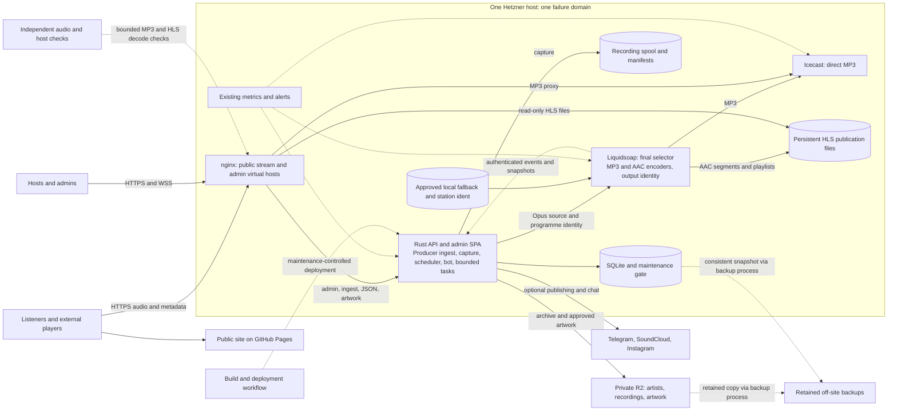

# Moafunk architecture v4 — continuous radio on one server

Status: Codex draft for Claude review, 2026-09-26. Not implemented or jointly accepted. Repository baseline: `13e73de`. Production configuration and measurements still need verification.

This combines [architecture v3](live-moafunk.proposal-v3.md) with the accepted [streaming design](../stream-rework/streaming-design.md). The streaming document owns codec, player, authorization, metadata, artwork and device-test details; this proposal adds server boundaries, deployment, resource and recovery contracts. It does not weaken those requirements.

## 1. Decision and scope

Keep one Hetzner host, nginx, the Rust API with SQLite, Liquidsoap, Icecast, private R2 and the existing monitoring stack. Keep the public site on GitHub Pages. The admin SPA remains in the backend image initially. Do not add Kubernetes, a database server, a general queue or a second origin for this release.

Separate their operating lifecycles: station audio must continue through a normal API replacement using locally available fallback. The API still owns live ingest and recording, so normal replacement waits for active producers and capture to finish safely. API crashes can interrupt a host's live input; fallback preserves the station session where the media stack remains healthy. This is not uninterrupted live-host delivery across API failure.

Continuous station playback is confirmed by Anton. The inherited 200 concurrent listeners and small budget are planning assumptions, not measured capacity, a hosting purchase or an uptime promise. Full host loss remains an outage. Strict freshness of lock-screen metadata while page JavaScript is suspended remains outside the website guarantee.

### What changes from architecture v3

- Fallback playlist and emergency ident become launch prerequisites, with no scheduled-end player stop.
- Stable public stream host, permanent MP3 and native HLS for qualified Apple clients become required.
- HLS has persistent publication files served directly by nginx; Icecast serves MP3.
- Maintenance gates producer/capture work, not continuous station playback.
- External probes check both formats continuously, with separate missed-show detection.
- Recording recovery gets durable state now; a general publishing job system stays deferred.

## 2. Target topology and ownership

Arrows to storage describe access by the named process, not active storage daemons. The diagram is a proposed topology; it does not assert today's deployment already implements the new contracts.

| Boundary | Owner and lifetime | Failure effect |
| --- | --- | --- |
| Listener delivery | nginx, Icecast, Liquidsoap and HLS files; independent of API container replacement | Media-stack failure may interrupt listeners; API absence must not stop fallback output |
| Application | One API process: admin, auth, DB writes, scheduler, producer WS/ffmpeg, recording, bot/chat, bounded background work | Live input and new show starts depend on this process; remote publishing failure must not block audio |
| Durable state | Mounted SQLite, recording spool/manifests, local fallback assets, HLS publication state | Container/image replacement preserves these; disk loss does not |
| Remote media | Private R2, using explicit object references and immutable published versions | R2 outage delays uploads/artwork; local fallback still plays |
| Monitoring and backup | Existing local stack plus an external observer and retained backup destination | Neither local monitoring nor another directory on the same disk covers total host loss |

Keep Liquidsoap and Icecast under their existing separate supervision. They currently run as host-networked containers launched by systemd; they are not children of the API container. Scope each deployment to its target service. The current backend workflow can also sync and restart Liquidsoap; split that change into an explicit media-maintenance path.

No request for ongoing MP3/HLS audio should require a live API response, a SQLite query or an R2 fetch. Stage approved fallback assets on local storage before activating them. Public test/rehearsal audio never enters the public selector; review existing preview-route access separately from the anonymous station routes.

## 3. Public and internal interfaces

Use the streaming design's stable public host and full route map: `/live.mp3`, `/live.m3u8`, `/hls/live.m3u8`, epoch-qualified HLS segments, M3U/PLS, `/now-playing.json` and immutable artwork. Final hostname requires the existing domain-owner handoff; preserve old working URLs as aliases. A new hostname on this host does not create redundancy.

nginx proxies MP3 to Icecast and reads published HLS files read-only. Liquidsoap or its tested publication adapter is the sole HLS writer. Atomic playlist publication, persistent sequences, retained old segments and separate cleanup follow the streaming contract. No API deploy may remove or recreate that volume. HLS persistence enables recoverable process restart; full disk loss is a tested nonseamless case.

The public metadata and show-artwork routes stay backend proxies. During API downtime, metadata may fail and cached artwork may be unavailable on a cache miss. Do not invent fresh state through a long proxy cache. Clients retain their last values as stale and keep audio playing. Serve a versioned station artwork asset with the static site for a local UI fallback. Fresh metadata during API maintenance is a possible later publication component, not a first-release promise.

Liquidsoap retains the staged programme descriptors it needs for fallback and ICY transitions. Metadata callbacks use bounded timeouts/buffering and cannot stall the audio pipeline. On API return, public output stays unknown until the verified current-process epoch handshake and fresh snapshot succeed. A stale callback never activates an old epoch.

Keep the existing internal callback path through `127.0.0.1:8000`, authenticated and denied at public reverse proxies. The API container's harbor access must remain restricted to the required host bridge path. Do not expose source credentials, Icecast admin, database, metrics, service control or arbitrary R2 objects on the public streaming host. Public artwork remains an allowlisted projection of approved private objects.

## 4. Maintenance without waiting for the station to stop

Build images automatically; initially deploy manually through one controlled procedure. Do not restart the API on every successful build. Select immutable image digests and keep the last known good image/configuration pair.

The maintenance gate is persistent application state, not a one-time public status poll. Serialize all manual/scheduled live, prerecorded and recording-start paths with gate acquisition. A start either owns a registered session before the gate closes, or is rejected while it is closed. Track in-flight starts and finalisation as well as active producers. Rehearsal/capture counts even when public `active` is false.

Gate states: open → draining → ready → replacing → verifying → open. Record an operation ID and owner. Set draining atomically before checking readiness; survive API restarts and default closed for an incomplete operation. A deployment timeout or lost owner never silently reopens starts. A privileged operator can reconcile the operation and deliberately release it; concurrent deploys must not replace its ownership.

For normal API replacement:

1. Acquire the gate; stop scheduling new work that cannot be safely interrupted. Existing producers may finish; do not force-stop them.
2. Require no producer/rehearsal/capture, no pending start, and a safe recording handoff. Initially wait for finalisation to finish. After the durable recovery contract in §5 is implemented and tested, pending resumable archival may remain.
3. Confirm local fallback and both listener outputs work. Output unknown or unhealthy blocks normal maintenance; explicit incident repair is a separately logged override.
4. Replace only the API. Keep nginx, Liquidsoap, Icecast, local assets and HLS publication alive. Pause optional background tasks at a recoverable boundary.
5. Verify API/schema health, gate ownership, recording reconciliation and output epoch handshake. Verify both audio formats externally. Release the gate deliberately.

If replacement fails, keep fallback running and the gate closed. Roll back only to a compatible image/schema pair. Use backward-compatible migrations and a pre-migration consistent DB snapshot; destructive migrations require a separate restore plan. An emergency override records who, why and the expected live/recording interruption; it is not a hidden `FORCE_DEPLOY` shortcut.

| Change | Procedure and limit |
| --- | --- |
| Public frontend | Deploy static assets; running listeners do not reload while listening intent is active. Vite transport rollback needs rebuild/deploy. |
| API or bundled admin SPA | Use the gate above. A separate admin-static deployment can be considered later. |
| Liquidsoap/encoder configuration | Explicit media-maintenance window, staged validated config and rollback; test locked-iPhone HLS restart continuity. Do not promise gapless MP3. |
| Icecast replacement | Explicit window; MP3 connections can drop. HLS is served separately, but verify an Icecast output failure cannot block the shared Liquidsoap pipeline. |
| nginx configuration/certificates | Validate and reload gracefully; check long-lived streams and old workers. A restart or forced worker shutdown can interrupt listeners. |
| Docker/OS/reboot | Preserve existing restart protections, but announce host maintenance. One-host reboot is a station outage. |

nginx documents graceful reload preserving existing clients; verify local timeouts for indefinite MP3 connections. Docker live restore addresses daemon unavailability, not deliberate application replacement or a host reboot. [nginx control](https://nginx.org/en/docs/control.html), [Docker live restore](https://docs.docker.com/engine/daemon/live-restore/).

Scheduled end releases a producer according to its show workflow; it does not close the station output. Missed scheduled starts during maintenance are visible to operators and are not silently played late without an explicit policy.

## 5. Recording and background work

Keep capture separate from public fallback: archive the intended host/show recording, not an endless recording of the station loop. The existing recording tee is independent of the rehearsal-to-live encoder switch, but still shares the API process and host disk.

Introduce a small persistent recording manifest/state contract; do not require a general job platform. Record a recording UUID, show/version, producer generation, ordered closed segments, track markers, completion/incomplete state, expected object keys and verification results. Persist markers during capture. Files and SQLite are not one atomic transaction: use idempotent reconciliation across crash points, deterministic object references and atomic manifest publication.

Lifecycle: capturing → sealed → upload pending → remote verified → indexed → cleanup eligible. A crash may leave an incomplete capture, which must be visibly marked. Recover only complete valid segments; quarantine or repair an incomplete tail with validated tooling. A maintenance handoff is safe only when capture has stopped, data and manifest have reached their documented durability boundary and restart can discover the pending work.

Serialize finalisation, recovery and cleanup per recording. After restart, recover/reconcile before cleanup. Remote object existence or positive size alone is not proof that the intended complete archive and its DB references are safe. Verify expected size and a content checksum using supported remote checksum behavior, or a read-back check; multipart ETag is not a universal checksum. Commit the corresponding DB record before deleting local data. A crash after upload or DB commit must resume without duplicate versions or publishing the wrong artifact.

Never delete unverified recordings solely by age or disk pressure. Unreferenced partial uploads need a separate retention/cleanup rule. Expose stuck or incomplete work and manual retry. Optional SoundCloud/Instagram/Telegram publication is downstream of durable archive success; its failure cannot hold the recording capture open or block station audio.

Initially allow one heavy non-live media job at a time. Keep ingest, recording and the continuous MP3/AAC encoders outside that semaphore. Prioritize archive transfer over optional video generation, waveform/export and social publishing. Bound subprocess time, memory, CPU and I/O; abort optional work before it starves capture. Existing bot/chat stays in the API; an external outage does not grant it unbounded retries or memory.

A durable general publishing queue and separate worker remain deferred. If added later, domain change and queued intent commit together, retries use leases/backoff, and ambiguous provider outcomes are reconciled before retry. A separate ingest service is justified if uninterrupted live-host API deployment becomes required or measurements show the current process boundary is insufficient; it then needs scoped admission, session ownership and a separate recording handoff design.

## 6. Storage and resource budgets

| Storage class | Policy |
| --- | --- |
| SQLite | Persistent local volume; short transactions; inspect effective connection PRAGMAs. Do not lower durability for a presumed speed gain. |
| Recording spool | Dedicated directory and usage accounting; reserve the longest supported capture plus processing copies, measured at the actual capture format. No deletion of unverified data. |
| Fallback and ident | Validated local assets and descriptors, read-only to the playout process; keep active assets during API/R2 outages. |
| HLS publication | Persistent state and bounded segment retention; its cleaner cannot traverse recording or fallback directories. |
| Artwork | Immutable private sources and persisted derivatives as agreed; bounded memory cache, no deletion of published versions in the initial policy. |
| Logs, images, exports | Explicit quotas/rotation/cleanup; these must not consume the reserve needed for audio publication and capture. |

Separate directories on one disk are not isolation. Enforce usable space budgets where practical, monitor free bytes and inodes, and stop nonessential writes before reaching the protected reserve. Reject a new capture clearly if capacity cannot support it; do not wait for ENOSPC in an active recording. Shared-kernel CPU, disk and OOM risks remain even with separate containers.

Measure with 200 mixed MP3/HLS listeners, live capture, both encoders and one permitted background job. All-MP3 payload is 51.2 Mbit/s and 16.59 TB per 30 days; all-AAC at 128 kbps is 25.6 Mbit/s and 8.29 TB. A 50/50 mix is 38.4 Mbit/s and 12.44 TB. Add TLS/HTTP, HLS requests, monitoring, archive and backup traffic. Listener counts do not multiply encoders. Continuous listening makes the monthly case relevant even when shows are short.

These are calculations, not a server benchmark or verified traffic allowance. Confirm actual CPU/RAM/disk/link limits and the account's billing allowance. Add capacity on measurement; a second origin for availability is a separate decision.

## 7. Monitoring and backup

Keep local Prometheus/blackbox/Alertmanager/Grafana where already deployed; verify alert delivery rather than assuming an old issue is still open. Add host disk/inodes, memory/CPU, recording backlog, encoder health, stale HLS playlist, missing segments and metadata age.

An independent observer continuously fetches bounded samples of MP3 and HLS and decodes them. Suggested initial cadence: 60 seconds, warning after three consecutive failures, with short transition/silence grace tuned against real content. The checker must not require the origin API to decide whether it should run. During expected shows, separately alert on fallback/no producer after the agreed grace using a cached schedule with freshness shown. Healthy fallback must not hide a missing host.

Test that a human receives host-down and audio-failure alerts through an external path that does not depend on the origin's Telegram bot. Keep notification deduplication and documented maintenance suppression; a maintenance window must expire and must not suppress checks permanently. If available monitoring cannot decode audio, report that missing coverage and use recorded manual checks until a suitable observer is provided. Do not claim full external audio monitoring from an HTTP status probe.

Back up both artists and finalized-show buckets, including immutable artwork versions, plus consistent SQLite snapshots and required application/media configuration. Keep authoritative fallback/ident originals recoverable. Recording manifests and not-yet-uploaded segments remain a separate host-loss exposure; local durability is not an off-site copy. HLS segments are transient, not a historical media archive; restart persistence and full-host restore are different contracts.

Proposed metadata recovery point: at most 24 hours once daily backups are working. Copy newly verified archives incrementally; measure and alert on backup lag. Proposed retention: 30 daily DB snapshots and at least 30 days of replaced/deleted media versions, without making a full media copy per snapshot. Inventory restores must keep DB references and object versions consistent. The backup identity cannot silently delete the only retained good copy. Prefer an independent account/provider; record the remaining account-loss exposure if only same-account copies exist. Destination/cost selection needs actual volume and available resources, not an invented budget.

Use SQLite's consistent backup mechanism; copying a live DB file alone is insufficient. Inspect the installed driver's settings; WAL still has one writer and relaxed synchronization can lose recent commits on power loss. [SQLite backup](https://www.sqlite.org/backup.html), [synchronization settings](https://www.sqlite.org/pragma.html#pragma_synchronous).

Restore into an isolated environment with publishing, bot actions and live playout disabled. Check DB integrity and object references, play a restored recording, load artwork, and start approved fallback using restored configuration. Record elapsed recovery time after backup changes and monthly initially. No numerical recovery-time promise exists until the exercise measures it.

## 8. Implementation sequence and acceptance

1. Inventory deployed endpoints, versions, mounted paths, effective DB settings, alert recipients and backup coverage. Confirm rehearsal and independent listening; label repository facts separately from production checks.
2. Stop uncontrolled API replacement; establish the maintenance gate and operator recovery path. Repair external alert delivery, storage reserve alarms and backup coverage. These changes need not wait for HLS.
3. Implement recording handoff/recovery/cleanup ordering and resource bounds; prove restart and upload failure safety. Until proven, maintenance waits for full finalisation.
4. Implement the accepted player/status/auth/identity/artwork contracts and local fallback. Add stable public routes and HLS publication via the installed-version harness. Make continuous playback an end-to-end release, including the page.
5. Qualify real Apple devices and other supported clients; run mixed-load, fault and restore exercises. Native HLS becomes the default only when its gates pass. Keep MP3 and old URL aliases available.
6. Roll out through at least two full shows plus between-show playback. Keep application rollback separate from media configuration rollback. Publish the actual operating limits and unresolved qualification results.

Required architecture exercises: simultaneous start versus maintenance acquisition; API crash/replacement during fallback; attempted replacement during rehearsal/live capture; late producer cleanup; crash at every recording handoff boundary; R2 unavailable; disk-pressure protection; social provider outage; Icecast output failure with HLS active; Liquidsoap crash/restart with a locked iPhone; stale callbacks after API restart; metadata failure with healthy audio; bounded 200-listener load; missing scheduled producer despite healthy fallback; origin unreachable; isolated restore.

The streaming document's full device and latency targets still apply. A fresh browser with an iPhone user agent is not iOS validation. Documentation acceptance is not deployment or qualification.

## 9. Decisions deferred without hiding their limits

- Separate ingest process: required if live-host continuity through API replacement/failure becomes a launch requirement; otherwise maintenance gating plus station fallback is the first release.
- Separate worker/general jobs: only after measured resource or durable publishing needs justify it. Recording durability itself is not deferred.
- Independent origin: same escalation rule as the streaming design—one unrecovered origin failure during an announced show triggers review; an origin-survival launch requirement makes a second failure domain and failover exercise prerequisites.
- Metadata publication independent of API: only if stale/unavailable public metadata during API maintenance is unacceptable; needs an explicit versioned publisher contract.
- Backup provider, external observer and exact capacity limits: resolve during inventory using existing resources where possible. Their acceptance tests are required before claiming their protections.

Claude: review v4 and record acceptance or concrete changes in `claude-review.md`. No joint acceptance yet.
